TITLE 
# Microservice containerized application and CI/CD process flow

# Project description
How to Avoid the web application traffic in peak hours and mannage the all traffic without down-time
# Project description

I create one hospital sample application for automate orchestration and kubernetes micro service module. so we use Containaraized application for user traffic managing and effective usage also. Add some monitoring tool and proplem triggering  alarts for curicial time.so, I try to make a examble of good application modules and process flow for CI/CD 

# Core Azure services

Am try to make a end to end automating so, I used azure devops tool and some open source tools.
real time aspects like (DEV,QA,PROD) and Devops methodology.

* AKS
* VM
* Mongo DB
* SQL DB
* Storage service
* Azure devops
 
## Acknowledgements

 - [Docker](https://www.docker.com/)
 - [Kubernetes](https://kubernetes.io/)
 - [Jenkins](https://www.jenkins.io/)
 - [Microsoft-Learn](https://www.google.com/url?sa=t&rct=j&q=&esrc=s&source=web&cd=&cad=rja&uact=8&ved=2ahUKEwij1Yjiwsz1AhWeyzgGHbLqAO4QFnoECAwQAQ&url=https%3A%2F%2Fdocs.microsoft.com%2Fen-us%2Flearn%2F&usg=AOvVaw2jLCff1yMidxbmbbYgnosS)
 - [cloud guru](https://www.google.com/url?sa=t&rct=j&q=&esrc=s&source=web&cd=&cad=rja&uact=8&ved=2ahUKEwic45WNw8z1AhV13jgGHdm7CFAQFnoECAkQAQ&url=https%3A%2F%2Facloudguru.com%2F&usg=AOvVaw3WP3trCZZnS3RLLu2KOcmD)

## Screenshots
Azure Infrasture micro-service diagram
## prototype a working model 

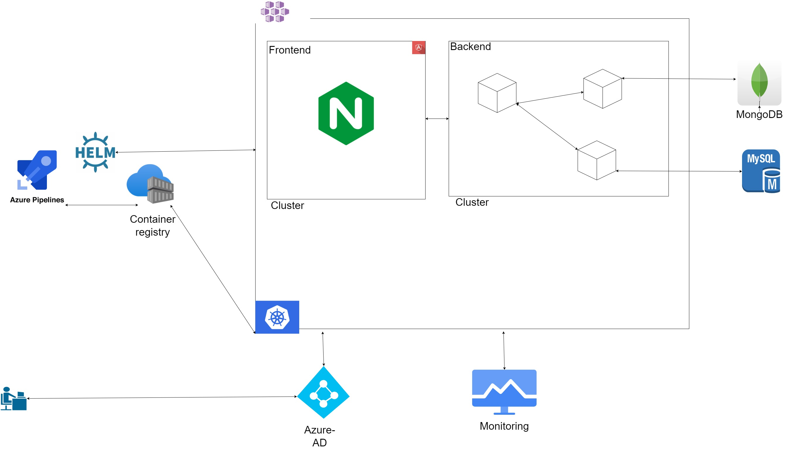

CI/CD open source idealogy Infrasture micro-service diagram

App Screen-shot

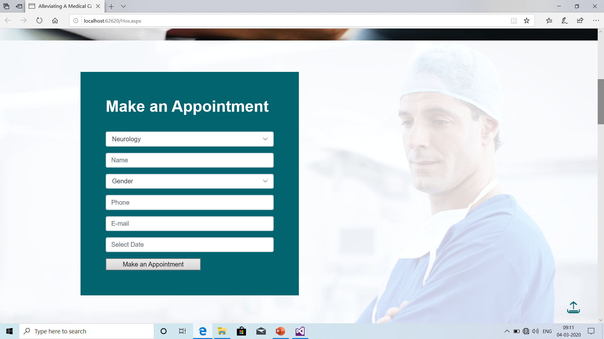

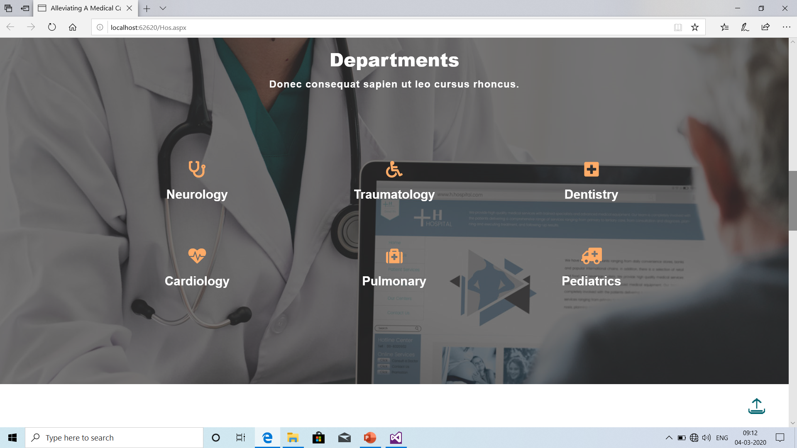

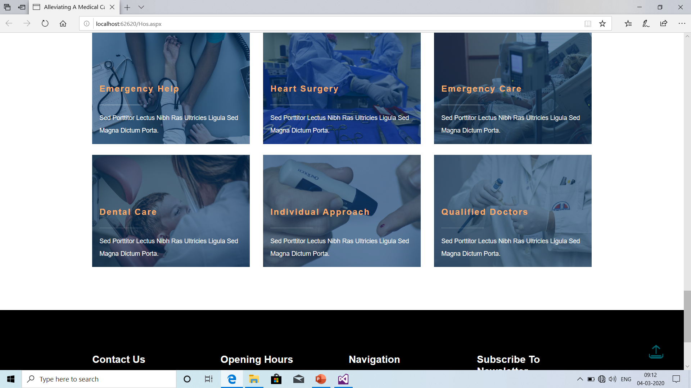

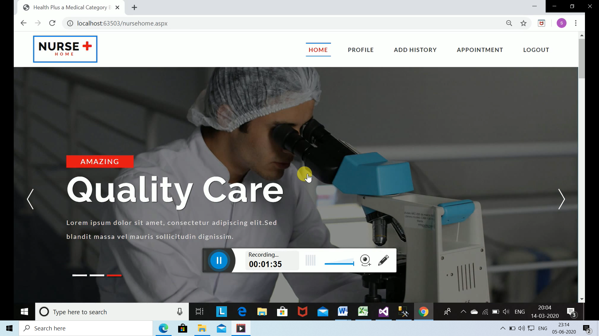

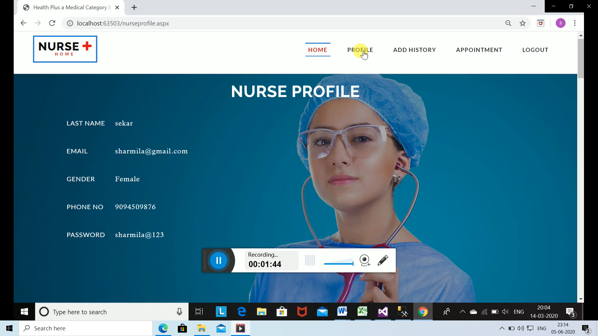

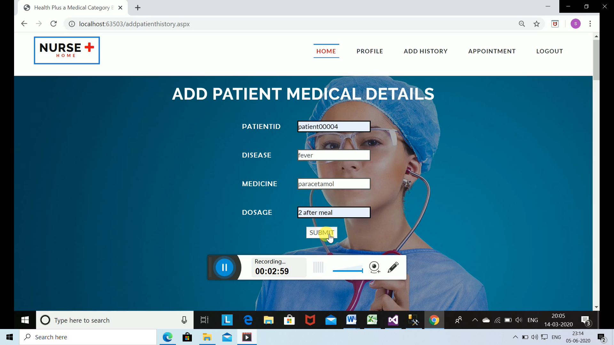

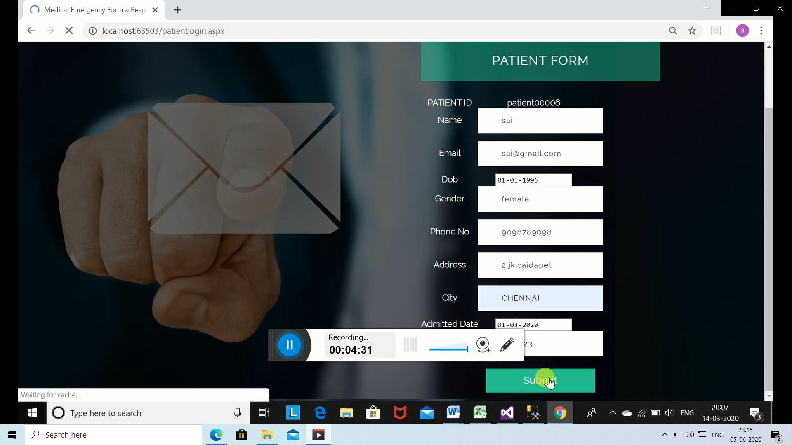

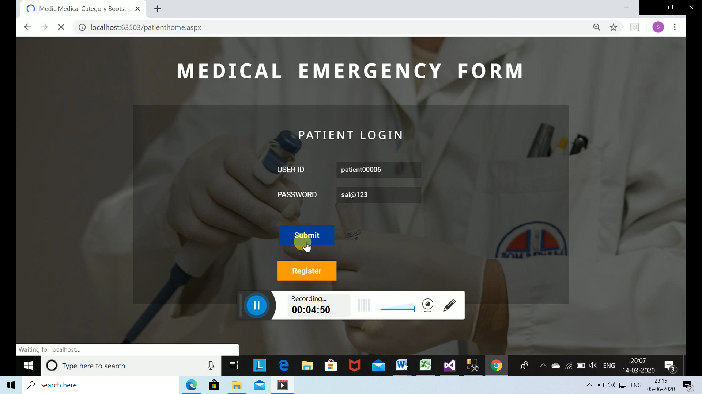

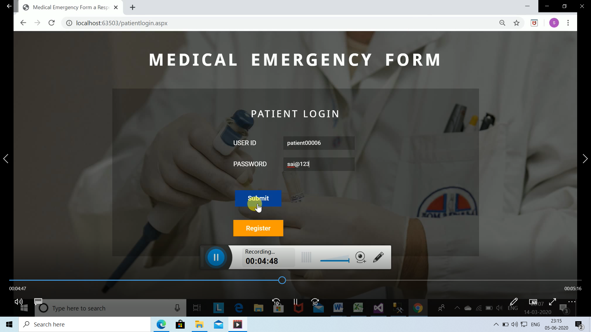

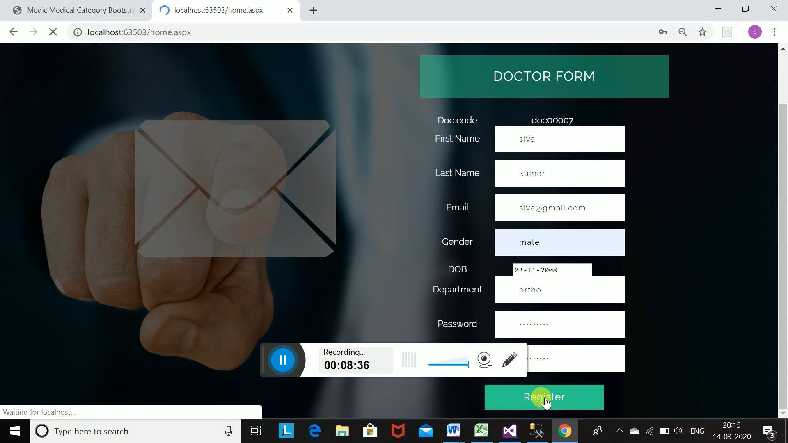

 
## Project video 

 - [Project-videolink](https://user-images.githubusercontent.com/81232337/151606910-d67abea3-2003-4e33-b63b-ca2f68a355ea.mp4)

Development:

 https://user-images.githubusercontent.com/81232337/151606910-d67abea3-2003-4e33-b63b-ca2f68a355ea.mp4

"# Jeeva-Hospital-employee-management-system" 
"# Maduram-Hospital-managemnt-" 
